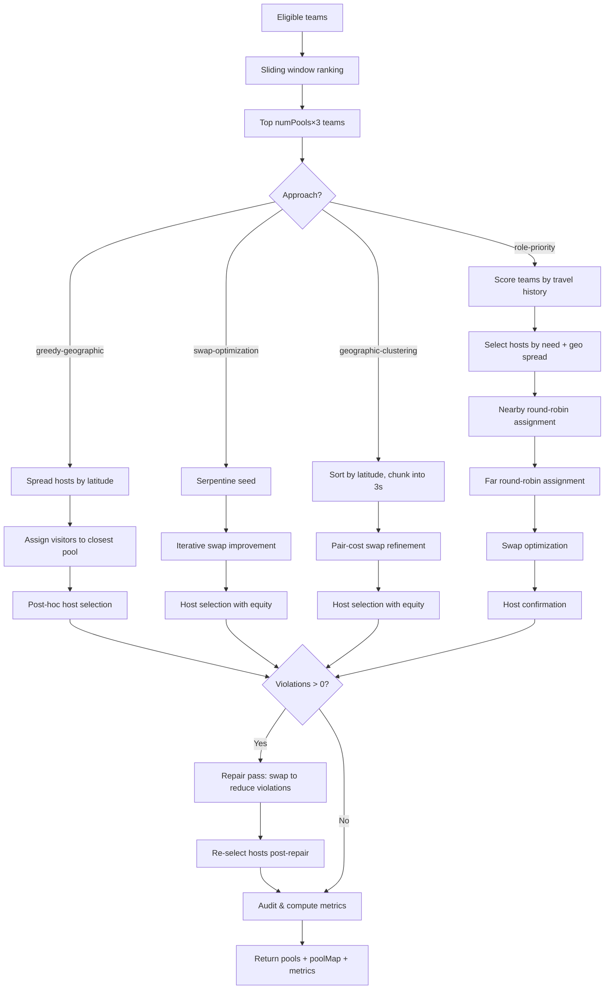

# Pool Prediction Algorithm Specification

## 1. Overview

The pool prediction algorithm attempts to reproduce how the FFVB assembles pools of 3 teams for the national rounds (day >= 5) of the Coupe de France youth volleyball competition. Based on analysis of 833 historical pools, the algorithm follows a **geography-first, constraint-enforced** approach.

The algorithm is invoked via `predictPools(competition, day, config)` in `src/model/model-pools.ts`. It supports four approaches, each producing a set of pools with metrics. All approaches share the same constraint framework and host selection logic.

### When It Runs

The algorithm runs in **sliding window mode**: team eligibility and rankings are computed from a 4-day sliding window ending at the current day. It can predict pools for upcoming days (before results are known) or replay historical days for comparison.

### General Flow

1. Determine eligible teams (in course, not eliminated)
2. Rank teams using sliding window
3. Select top `numPools × 3` teams
4. Assign teams to pools using the chosen approach
5. Repair any remaining constraint violations
6. Select hosts within each pool
7. Compute quality metrics

---

## 2. Input Preparation

### 2.1 Team Eligibility

`isTeamInCourse(competition, team, day)` determines which teams remain in the competition:

- **Day 1**: All teams are eligible
- **Day N (N > 1)**: A team is eligible if it finished 1st or 2nd in its pool on day N-1

### 2.2 Third-Place Filtering

`filterThirdPlace(teams, day)` handles the case where the number of eligible teams is not a multiple of 3. Teams that finished 3rd are eliminated first. If removing all 3rds leaves a deficit (not divisible by 3), the best-ranked 3rds are saved to fill the gap.

### 2.3 Sliding Window Ranking

`getSlidingDay(competition, day)` computes the effective ranking day:

- If the current day is a PF (playoff) day, use day - 1
- Otherwise, use `min(day, lastDay) + 1`

Teams are sorted using `matchSorter(slidingDay, true, true, 4)`, which applies a multi-criteria ranking system over a 4-day window: points, match wins, set ratio, point ratio, TrueSkill rating.

### 2.4 Pool Count

Only the top `numPools × 3` teams are used, where `numPools = floor(eligibleTeams / 3)`. Excess teams beyond this count are excluded.

---

## 3. Hard Rules

Hard rules are **never violated** in the final output. If an approach produces violations, the repair pass fixes them.

### 3.1 No Shared Pool

Two teams that have already been in the same pool on any previous day in the same season must not be placed in the same pool again.

```typescript
haveSharedPool(a, b, day): boolean
// Checks all days 1..day for matching pool assignments
```

### 3.2 Min 1, Max 2 Firsts per Pool

Each pool must contain at least 1 and at most 2 teams that finished 1st in their previous-day pool. This prevents "groups of death" (3 winners together) and ensures competitive balance (at least 1 winner per pool).

```typescript
hasNoFirst(pool, day): boolean   // 0 firsts → violation
hasThreeFirsts(pool, day): boolean  // 3+ firsts → violation
```

---

## 4. Soft Rules

Soft rules are optimized during pool construction but may be relaxed when hard rules conflict.

### 4.1 Geographic Distance — Asymmetric "1 Close + 1 Far"

The **travel cost function** rewards pools where one visitor is nearby and one is far, rather than both being at medium distance. This matches the observed FFVB pattern (avg 202 km near vs 398 km far).

For each pool, pairwise haversine distances are sorted ascending, then weighted:

```typescript
const POOL_CONFIG = {
  nearFarWeights: [2.0, 1.0, 0.5] as const,
  // ...
};

// cost = distances[0] × 2.0 + distances[1] × 1.0 + distances[2] × 0.5
```

The heaviest weight on the shortest distance makes the optimizer prioritize having at least one short distance, while tolerating one long one.

**Distance balance penalty**: The standard deviation of per-pool host distances is penalized (weight 1.5 per km of stddev) to prevent all-nearby pools alongside all-distant pools.

### 4.2 Role Equity — Host/Nearby/Far Balance

Each team accumulates a role history across days: how many times it has been host, nearby visitor, or far visitor.

**Equity penalty formula**: For each role (host, nearby, far), compute the proportion of that role in the team's history. If it exceeds 1/3 (the fair share for 3 roles), the excess is penalized.

```
penalty = (hostExcess + nearExcess + farExcess) × equityWeight
```

Where `equityWeight = 30` (km equivalent, so equity concerns compete with ~30 km of geographic optimization).

### 4.3 No Consecutive Hosting

Teams that hosted on the previous day are deprioritized during host selection. This is a soft constraint: if all candidates hosted yesterday, the centroid-closest team is used anyway.

---

## 5. Algorithms

### 5.1 Greedy Geographic

**Approach**: Seed pools with geographically spread hosts, then greedily assign remaining teams to the closest valid pool.

1. **Host selection by latitude**: Map all teams to coordinates, sort by latitude, pick `numPools` hosts at regular stride intervals, avoiding same-department duplicates
2. **Fallback**: If not enough hosts after department filtering, relax the constraint
3. **Visitor assignment**: Sort remaining teams by distance to nearest host (closest first). For each team, evaluate all non-full pools and assign to the closest one that doesn't violate hard constraints
4. **Post-hoc host selection**: After all teams are assigned, run `selectHosts` to optimize host choice within each pool

### 5.2 Swap Optimization

**Approach**: Start from a serpentine seed, then iteratively improve by swapping teams between pools.

1. **Serpentine seed**: Assign ranked teams in zigzag order across pools (rank 1 → pool 0, rank 2 → pool 1, ..., rank N → pool N-1, rank N+1 → pool N-1, rank N+2 → pool N-2, ...)
2. **Combined cost**: `travelCost + equityPenalty + distanceBalancePenalty`
3. **Iterative improvement** (max 100 iterations): For every pair of teams in different pools, tentatively swap and accept if:
   - Violations decrease (priority), OR
   - Violations don't increase AND combined cost decreases
4. **Host selection**: Run `selectHosts` with equity and consecutive-hosting avoidance

### 5.3 Geographic Clustering

**Approach**: Sort teams by latitude, chunk into consecutive groups of 3, then refine with swaps.

1. **Latitude sort**: All teams are sorted by their latitude coordinate
2. **Chunking**: Teams are grouped into consecutive blocks of 3 (team 0-2 → pool 0, team 3-5 → pool 1, ...)
3. **Pair-cost swap optimization** (max 50 iterations): Same swap loop as 5.2, but computes cost only for the two affected pools (not all pools) for efficiency
4. **Host selection**: Run `selectHosts` with equity and consecutive-hosting avoidance

### 5.4 Role-Priority Pools

**Approach**: Primary driver is role fairness; hosts are chosen first based on travel history, then teams are assigned in nearby/far rounds.

1. **Host need scoring**: Each team gets a score based on recent role history. Teams that traveled far recently get higher scores (higher priority to host). Uses recency weights `[1.0, 0.5, 0.25]` over the last 3 days.
2. **Host selection**: Pick `numPools` hosts from highest-need teams, spreading by department, skipping yesterday's hosts
3. **Nearby assignment (2nd slot)**: Sort remaining teams by distance to nearest host (closest first), assign each to the closest non-full pool with round-robin offset to prevent bias
4. **Far assignment (3rd slot)**: Sort remaining unassigned teams by distance to nearest host (farthest first), assign each to the farthest non-full pool
5. **Swap optimization**: Same combined-cost swap loop as 5.2 (max 100 iterations)
6. **Host confirmation**: Final `selectHosts` pass

---

## 6. Host Selection

`selectHosts` reorders teams within each pool so that position 0 (the host) is optimal.

### Algorithm

1. **Compute pool centroid**: Average latitude/longitude of all teams in the pool
2. **Rank by centroid distance**: Sort teams by haversine distance to centroid (closest first)
3. **Consecutive hosting filter** (if enabled): Remove candidates that hosted on the previous day, unless all candidates hosted yesterday
4. **Equity tie-breaking** (if enabled): Among candidates within `hostEquityThreshold` (20 km) of the best, pick the team with the fewest prior hostings
5. **Swap into position 0**: Move the chosen host to the first position

### Escape Hatch

After host selection, if the chosen host still hosted yesterday (all candidates did), attempt a swap with the nearby visitor (the team closest to the host). This provides a secondary chance to avoid consecutive hosting.

---

## 7. Constraint Repair

After the main algorithm runs, a **repair pass** eliminates any remaining hard constraint violations.

```typescript
repairViolations(pools, day, trace);
```

- **Method**: Uses `improveBySwapping` with max 200 iterations
- **Acceptance criterion**: Accept any swap that reduces the violation count, regardless of distance impact
- **Priority**: Hard constraints trump soft constraints; the repair pass may increase travel distances
- **Break-on-first**: Enabled — each iteration stops at the first improving swap, then restarts scanning

After repair, hosts are re-selected because swaps may have moved yesterday's hosts into position 0.

---

## 8. Configuration Constants

| Constant              | Value             | Rationale                                                                                                      |
| --------------------- | ----------------- | -------------------------------------------------------------------------------------------------------------- |
| `nearFarWeights`      | `[2.0, 1.0, 0.5]` | Prioritizes one short distance over uniform medium distances, matching observed FFVB "1 close + 1 far" pattern |
| `equityWeight`        | `30`              | Equity penalty in km-equivalent; makes role imbalance comparable to ~30 km extra travel                        |
| `hostEquityThreshold` | `20` km           | Within this distance of the best host candidate, prefer least-hosted team                                      |
| `balanceWeight`       | `1.5`             | Penalty per km of stddev in per-pool host distances; prevents extreme distance variance across pools           |
| `repairMaxIter`       | `200`             | Maximum outer iterations for constraint repair swaps                                                           |
| `swapMaxIter`         | `100`             | Maximum outer iterations for cost-optimization swaps (approaches B and D)                                      |
| `clusterMaxIter`      | `50`              | Maximum outer iterations for geographic clustering refinement (approach C)                                     |

---

## 9. Decision Flowchart



---

## 10. Audit & Metrics

### Audit

`auditPools` logs detailed information about each pool for debugging:

- **Per pool**: Team roles (Host/Nearby/Far with distances), constraint violations, equity penalties
- **Summary**: Total hard rule violations (shared pool, no first, three firsts), soft rule violations (consecutive hosting, equity penalty), average travel cost, distance balance

### Metrics

The `PoolPrediction.metrics` object contains:

| Metric                 | Description                                                                  |
| ---------------------- | ---------------------------------------------------------------------------- |
| `avgPairDistance`      | Average haversine distance between all team pairs across all pools           |
| `avgHostDistance`      | Average haversine distance from host to each visitor                         |
| `constraintViolations` | Number of hard constraint violations (should be 0 after repair)              |
| `distanceStdDev`       | Standard deviation of per-pool host distances (lower = more balanced travel) |

---

## 11. Source Files

| File                           | Role                                                                        |
| ------------------------------ | --------------------------------------------------------------------------- |
| `src/model/model-pools.ts`     | All prediction algorithms, constraints, host selection, audit               |
| `src/model/model-geography.ts` | `getTeamCoords`, `getTeamDistance`, `haversineKm`                           |
| `src/model/model-helpers.ts`   | `isTeamInCourse`, `filterThirdPlace`, `getSlidingDay`, `getVirtualPoolName` |
| `src/model/model-sorters.ts`   | `matchSorter` (multi-criteria ranking)                                      |
| `src/model/model.ts`           | Domain types (`Competition`, `Team`, `Pool`)                                |
